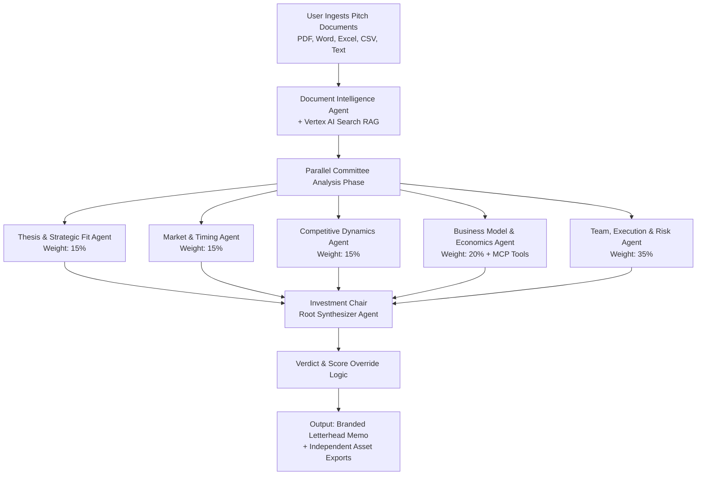

# CIO Agent: Multi-Agent Investment Intelligence
**An autonomous digital Investment Committee powered by Gemini 2.5 Pro & Google ADK**

---

## Overview
CIO Agent is a production-grade, keyless multi-agent architecture built for the **Google for Startups AI Agents Challenge 2026 (Track 1: Build)**It automates comprehensive due diligence processing on startup transaction materials—including pitch decks, financial models, and structured data tables—reducing weeks of manual investment committee vetting into minutes while maintaining institutional-grade rigor, transparency, and full audit tracking.

## Core Architecture & Orchestration
The system coordinates an Investment Committee structure using an asynchronous hierarchical multi-agent blueprint managed by Google's Agent Development Kit (ADK).



### Specialized Committee Seat Allocations

* **Document Intelligence Agent:** Manages content ingestion, structures heterogeneous text packages, and runs initial critical asset omission checks.
* **Thesis & Strategic Fit Agent (15% Weight):** Evaluates problem-solution fit narrative alignment and product scalability potential.
* **Market & Timing Agent (15% Weight):** Validates total addressable market (TAM) scope, adoption tailwinds, and macro trends.
* **Competitive Dynamics Agent (15% Weight):** Analyzes defensibility frameworks, proprietary IP, and customer switching costs.
* **Business Model & Economics Agent (20% Weight):** Evaluates monetization resilience and uses the **Model Context Protocol (MCP)** to securely discover and query external financial verification tools.
* **Team, Execution & Risk Agent (35% Weight):** Evaluates background execution capability, corporate governance controls, and regulatory parameters.


---

## Technical Stack & Production Footprint

* **Reasoning Engine:** Gemini 2.5 Pro via Vertex AI 
* **Orchestration Framework:** Google Agent Development Kit (ADK) 
* **Grounding Infrastructure:** Vertex AI Search for data grounding and RAG 
* **Compute Runtime Layer:** Fully containerized microservice deployed on Google Cloud infrastructure 
* **Authentication Posture:** 100% Keyless Identity Federation utilizing Google Application Default Credentials (ADC) and granular IAM service roles.


---

## Advanced Engineering Implementations

### 1. Model Context Protocol (MCP) Integration

To comply with the Track 1 technical mandate, the Business Model & Economics agent features a declarative, secure tool discovery engine built with the official ADK `MCPToolset` and `StdioServerParameters` modules. This allows the agent to autonomously discover and execute read-only market tracking tools at container boot without hardcoded code modifications.

### 2. Stateful Conversation Warm-Up Loops

The frontend web framework implements an asynchronous background initialization protocol to pre-warm a unique timestamped session tracking slot via the platform's session endpoint before routing prompt data, preventing cross-user conversation contamination.

### 3. XML Character Protection Matrix

Client-side parsing loops utilize nested conditional validation sequences instead of token logical operators (like raw ampersands) to remain completely internet entity immune within host template scripts.

---

## Deployment & Replication Guide

To replicate or launch this container pipeline on a bare-metal environment from scratch:

```bash
# 1. Initialize environmental context
mkdir -p app && cd $_
python3 -m venv venv
source venv/bin/activate
pip install -r requirements.txt

# 2. Local verification test
adk web app/

# 3. Deploy to production runtime using Application Default Credentials
gcloud run deploy cio-investment-committee-pipeline \
  --source . \
  --region us-central1 \
  --allow-unauthenticated \
  --update-env-vars GOOGLE_GENAI_USE_VERTEXAI=true,GOOGLE_CLOUD_PROJECT=adroit-producer-496319-s8,GOOGLE_CLOUD_LOCATION=us-central1

```

